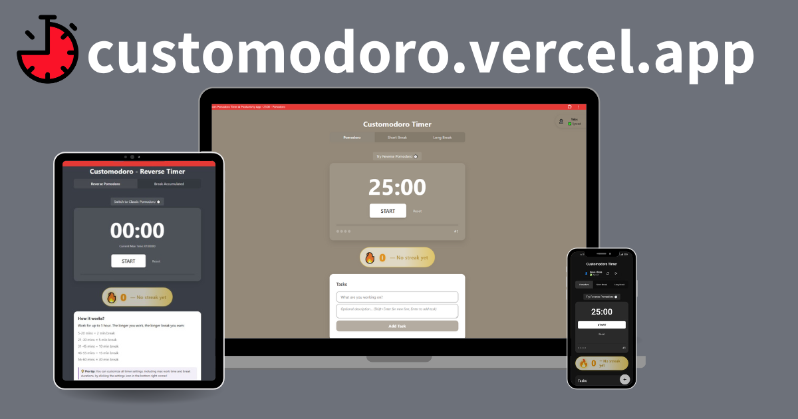
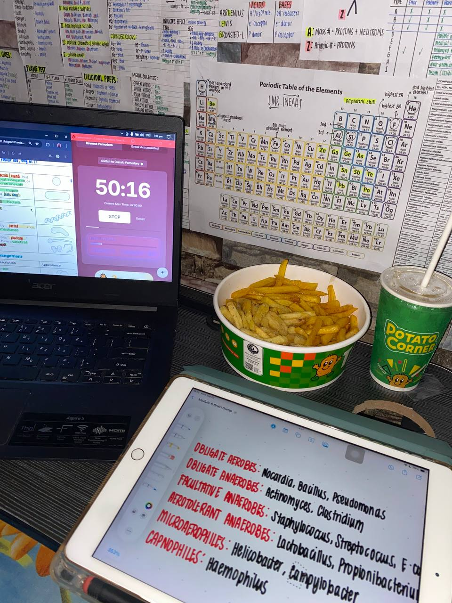
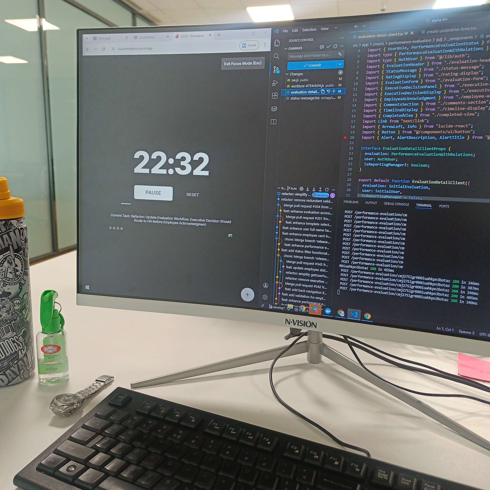

# 🍅 Customodoro

> A customizable, local-first Pomodoro timer for structured sprints, open-ended
> focus, and everything in between.

[](https://customodoro.vercel.app/)
[](https://customodoro.vercel.app/reverse)
[](LICENSE)



Customodoro is a free productivity timer built for people who want more control
than a fixed 25-minute countdown. Use the familiar **Classic Pomodoro**, switch
to **Reverse Pomodoro** when you want to earn breaks from time already focused,
and shape the experience with themes, tasks, music, analytics, and
distraction-free modes.

No account is required. Your timer, settings, tasks, and productivity history
work locally in the browser; an optional account adds cross-device sync and
leaderboard participation.

## Two ways to focus

| Mode | How it works | Best for |
| --- | --- | --- |
| **Classic** | Counts down through customizable work, short-break, and long-break sessions | Study blocks, planned sprints, and repeatable routines |
| **Reverse** | Counts focused time upward and awards a break based on the work completed | Deep work, creative flow, and tasks with uncertain duration |

Reverse mode includes a standard one-hour workflow and a dynamic mode for
longer sessions with configurable break tiers.

<p align="center">
  
</p>

## Highlights

- **Flexible timers** — customize durations, cycle counts, break tiers,
  auto-start behavior, alerts, and timer ambience.
- **Distraction-free focus** — Focus Mode, fullscreen controls, and Locked-In
  Mode with configurable timer, progress, session, and exit controls.
- **Tasks that stay useful** — add, complete, focus, reorder, and retain tasks
  while moving between Classic and Reverse modes.
- **Progress you can see** — contribution-style history, focus points, streaks,
  completed sessions, productive-day insights, and Classic/Reverse usage.
- **A space that feels yours** — light and dark modes, built-in visual themes,
  custom backgrounds, color palettes, and a compact music player.
- **Local-first by default** — core productivity data and preferences remain in
  `localStorage`; registration is optional.
- **Optional cloud features** — account restoration, cross-device data sync,
  achievements, and a Supabase-backed global leaderboard.
- **Installable web app** — PWA metadata and limited static asset caching support
  an app-like experience on modern browsers.

<p align="center">
  
</p>

## About Customodoro

**Customodoro was never planned. It started with a problem.**

While preparing for the Pharmacist Licensure Examination, my girlfriend,
Clarissa, told me that the usual Pomodoro technique did not work well for her.
Stopping after a fixed 25-minute session could interrupt her concentration just
when she had found her rhythm. I asked what kind of timer would fit the way she
actually studied.

Her answer became Reverse Pomodoro: start like a stopwatch, keep working without
an approaching countdown breaking your flow, and earn a longer break from the
time you have focused.

The first version followed the break system she imagined:

| Focus time | Break earned |
| --- | --- |
| 5–20 minutes | 2 minutes |
| 21–30 minutes | 5 minutes |
| 31–45 minutes | 10 minutes |
| 46–55 minutes | 15 minutes |
| 56–60 minutes | 30 minutes |

I built the first MVP while working as an intern. There was no product roadmap,
database, account system, or plan to find an audience—I simply wanted to make
an app that worked for her while she reviewed for her board exam. As far as I
knew, Clarissa would be its only user.

<p align="center">
  
</p>

That changed just after midnight on July 9, 2025. Clarissa posted a TikTok to
show her appreciation for the timer I had made for her. We expected nothing
from it, but the story resonated. Students, reviewees, professionals, and people
trying to protect their own focus discovered Customodoro and began suggesting
features. A personal project suddenly had a community, and their feedback
helped shape the Classic and Reverse timers, customization, analytics, sync,
and everything Customodoro has become.

The most meaningful milestone came a few months later: the person who inspired
the app, its first user, and the reason it exists passed the November 2025
Pharmacist Licensure Examination. She is now **Clarissa Mhae C. Pascual, RPh**.
What began as a timer for one important goal became a tool that could support
many other people through theirs.

Thank you to Clarissa for the idea and for believing it was worth sharing, to
every early user who sent feedback or reported a bug, and to
[Yuya Uzu](https://uzu.works/), creator of
[Pomofocus](https://pomofocus.io/), for generously sharing advice and
supporting our Product Hunt launch.

**Follow the journey:** read the
[full origin story](https://customodoro-blog.vercel.app/posts/midnight-tiktok-post-changed-everything),
see the [original TikTok post](https://www.tiktok.com/@wtvrclari/photo/7524766513920773384),
or follow Customodoro on
[LinkedIn](https://www.linkedin.com/company/customodoro) and
[X](https://x.com/customodoro).

## Try it

- [Classic Pomodoro](https://customodoro.vercel.app/)
- [Reverse Pomodoro / Flowmodoro](https://customodoro.vercel.app/reverse)
- [Pomodoro Technique guide](https://customodoro.vercel.app/pomodoro)
- [Feedback and bug reports](https://customodoro.vercel.app/feedback)

To install Customodoro, open the live app in a supported browser and choose
**Install app** or **Add to Home Screen**.

> **Coming soon:** The Customodoro Browser Extension is on its way to the
> Chrome Web Store and Microsoft Edge Add-ons, bringing quick access to your
> focus timer directly from the browser toolbar.

## Run locally

Customodoro has no frontend build step. Clone the repository and serve its
static files:

```bash
git clone https://github.com/yaaabs/customodoro.git
cd customodoro
npx serve .
```

Then open the local URL printed by `serve`. Opening the files through a local
HTTP server is recommended because service workers and some browser APIs do not
behave correctly on `file://` URLs.

## Development

The web app deliberately keeps a small footprint:

- semantic HTML pages;
- feature-oriented CSS;
- vanilla JavaScript loaded directly in the browser;
- `localStorage` for local-first state;
- a separate Express backend for optional account sync;
- Supabase-backed leaderboard reads;
- Node's built-in test runner for timer coverage.

There is no bundler or framework runtime. Scripts communicate through a small
set of `window.*` APIs, so script order in `index.html` and `reverse.html` is
part of the application contract.

### Useful commands

```bash
npm test                 # smoke and regression suites
npm run test:smoke       # timer lifecycle checks
npm run test:regression  # focused regression coverage
```

Node.js 14 or newer is required for the repository scripts.

## Project map

```text
index.html                 Classic Pomodoro app
reverse.html               Reverse Pomodoro app
pomodoro.html              Educational Pomodoro guide
feedback.html              Feedback page
css/                       Shared and feature styles
js/                        Timers, settings, sync, stats, audio, and UI
tests/                     Browser harness and timer tests
extensions/pomodoro/       Separate browser extension
manifest.json / sw.js      PWA metadata and service worker
robots.txt / sitemap.xml   Search crawl signals
```

For deeper implementation details, see
[`architecture/FRONTEND_ARCHITECTURE.md`](architecture/FRONTEND_ARCHITECTURE.md).

> [!NOTE]
> Customodoro is installable and caches selected static assets, but the current
> web app should not be described as fully offline: account sync, leaderboard
> data, and some restoration paths still require network access.

## Contributing

Bug reports, focused fixes, and thoughtful feature improvements are welcome.
Please preserve the static architecture, local-first data model, timer
single-completion guards, and behavior across both timer pages. Run the
narrowest relevant test suite before opening a pull request.

## License

Customodoro is available under the [MIT License](LICENSE).

Built by [Brian Yabut (YabuTech)](https://github.com/yaaabs) for anyone trying
to make focus fit the way they actually work.
